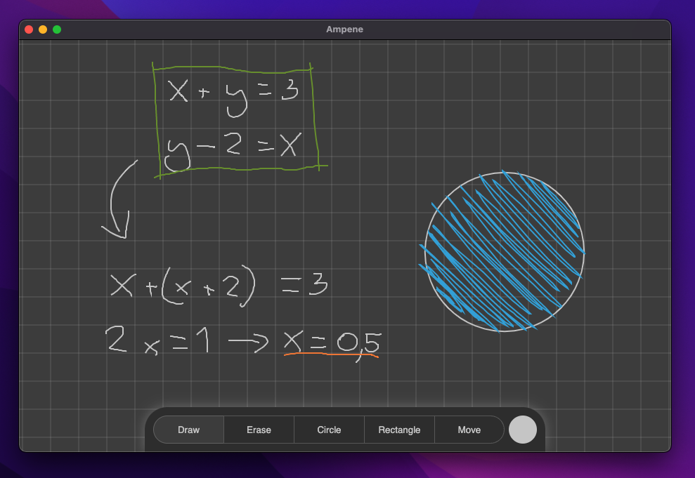

    <h1>Ampene</h1>
    
    
A sleek, modern note app for doing math on the computer.

## Overview
Ampene is a note taking app made in electron and react.js used for math related work on the computer. The program works best with a tablet. 

[Download the program here](https://github.com/PumpedSardines/Ampene/releases/tag/Latest)
## Platforms
- M1 Macs
- Windows 10 (Untested)

## Motivation
During online lessons i wanted a way to easily do math work from my computer. There were no programs that did what i wanted so i made one myself.

## License
See LICENSE file